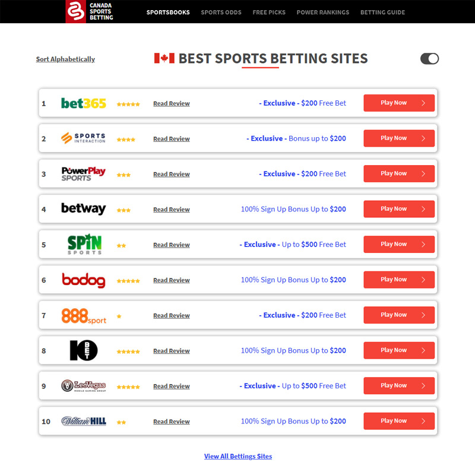

## BESTBETS Application

#### - [ Developed by Eaglex ](http://eaglex.net)


#### Overview
The application displays list of recommended casino websites by score.
It is build with Vue/Vuex 2, data flow is managed by Vuex Store, and handled through fake backend server to simulate REST/GET. 

* Website is production ready
* Live REST/GET option ready 
* Integrated with Vuex smart table
* Code is eslinted
* Mobile responsive
* Custom Google search query for `reviews`
* Alternative text display on mobile layout, using RegExp

<br>

### <span style="color:red">Latest updates</span>

<i>Project demo is now available on github pages: </i>

[ >> best-bets <<](https://eag1ex.github.io/best-bets)
<br>


<br>


##### Deadline
* Project build in 4 days.

#### Stack
- ES6, MVC, Vue/Vuex 2, Bootstrap Vue, Bootstrap, Webpack, Mock-backend, SCSS, Compass, eslint

#### BESTBET Live Demo
- Live demo is hosted on heroku node.js server (_server has timeout limit_):

```sh
## OLD, INACTIVE
# access:
# https://mysterious-brushlands-37485.herokuapp.com/login
# login: eaglex
# password: eaglex
```

#### Start/install application

```sh
$/ npm install
$/ npm start # will run dev server and open browser
$/ npm run build # will optimize all files for production
# you may need to install/ rebuild node-sass,
# have problems... refer to "engines":  < in package.json, remove it and try again.
```

##### Requirements

```sh
$/ npm install webpack -g
$/ npm install -g vue-cli # not too sure if required
```

- (optional) install `eslint` for VSC Recommended

#### Webpack
- There are 4 files common, development, production, and config.

```js
externals: {
// this is injected into the application dynamically, and api/base can be changed per build environment.
// global app config object
	config: JSON.stringify({
			apiUrl: API_BASE(),
			server: SERVER(),
			NODE_ENV: process.env.NODE_ENV
	})
},
```

#### REST/API
- there is option for `REAL` api switch in webpack configuration, when it becomes available
- to enable go to `webpack\config.js` > set `useServerInDev = "REAL"`, then run `npm start`.

##### mock-fake-backend
- to enable go to `webpack\config.js` > set `useServerInDev = "LOCAL"`, then run `npm start`.

#### Hierarchy
- Application structure
  **vue module components:** `/pages`
  **services:** `/libs/_services/**`
  **vue store module:** `/libs/_store/`
  **mock data:** `/libs/mock-data` 
  **fake-backend api:** `/libs/fake-backend.js`
  **/\/index.js:** `every libs service/module has index.js for export`
  **main ./index.js:** `root of application where all modules and plugins are imported`
  **./libs/router.js:** `all components are imported to this file`
  **./libs/styles** `all style/css plugins are maintained here and exported via index.scss, except for some of independent styles of components.`

#### TESTS
- Tested on lates Chrome and Firefox

#### TODO 
- (add) load more on action click

#### Bugs
- let me know.
- _not sure if this qualifies as bug_, but images need to be imported manually from `/src/libs/img` to `build/src/img` after build complete, _i have'nt configured webpack to run another process for this._

#### Thank you
